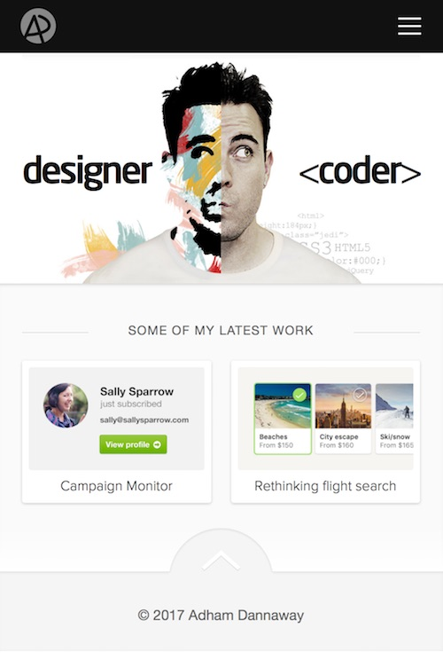

# Capstone Project - Web Portfolio
## Description
You will create a personal portfolio site to showcase your work to potential employers and/or customers. The site must include examples of your work, contact information, and your resume. The examples should include at least three different things you've created; those could be projects or exercises from this or other classes, or work you've done on your own. An effective portfolio will highlight your *best work*, and that work should correlates to your career goals. 

Here are some example portfolios that were created by IGM students:

- [http://dougwatro.com (utilized Bootstrap)](http://dougwatro.com)

Some other examples are here:
- http://www.adhamdannaway.com
- https://onepagelove.com

## Content Requirements
- the page is named index.html
- the page will have a navigation system to allow the user to quickly access distinct content
- it will include your name and an image (could be a photo or an avatar)
- Gallery page with brief information about each of your work examples (examples can be projects or exercises from this class or other classes, or work you've done on your own)
- Individual pages with more detail for each of your examples
    - each example needs a title, an image (could be a screenshot or photo), and a one-paragraph description that highlights the tools you used and the skills that it illustrates
    - if the example is from a group project, be sure to clearly indicate what your role was on the project
- Contact information page
- Resume (HTML, not PDF) that also has a printer-friendly stylesheet
- Notes page with information about how you made the site, including the following content: 
  - Source information for any images or code that you didn't create yourself (including CSS frameworks, typefaces, and any code libraries)
  - If you used a CSS framework, explain how you modified it so that your portfolio doesn't look exactly like every other site that uses that framework. 
  - What you did to go beyond the base expectations for the project--what did you do that was particularly challenging? This could involve art/design, content, or code. 
  - Must be called notes.html and placed in the portfolio directory, but linking to it from the portfolio navitation is not required (see the Submission & Due Dates section below)

## Design Requirements
- the site is a [responsive](https://en.wikipedia.org/wiki/Responsive_web_design), [single-page design](https://en.wikipedia.org/wiki/Single-page_application)
- It must have a minimum of two layouts--one optimized for desktop, one for phones
- It is assumed that you wil be using a CSS framework such as Bootstrap. If so, colors and typefaces must be modified so that the site is not a "cookie cutter" replica of the framework's templates
- Principles of visual design (taught in prerequisite classes) employed: clear visual hierarchy, good use of white space, effective alignment of content, thoughtful choices of colors and visual elements
- Effective typography employed; typeface(s) chosen should be clear and legible as well as appropriate to the content being presented
- The initial "landing" on the page should be compelling, ideally with a tag line and page design that "pulls" the user in. 
Here are some examples:

### http://www.adhamdannaway.com

### Here is the mobile version of the same page**

### dougwatro.com

### Lynda.com Bootstrap example

## Technology Requirements
- Semantic, valid HTML
- Well-structured, valid CSS
- Passes WAVE accessibility evaluation without significant errors 
- Semantic HTML
- Images and other media are properly optimized (both file size and image dimensions) for screen display

## Grading
If you complete all required components with no errors, you'll earn 16/20 points, or 80%. In order to go above that, 

Requirement | Possible Points (20) |
----------- | --------------- |
All required content present | 3 |
Written content quality and organization | 3 |
Responsive Design | 2 |
Visual Design | 2 |
Typography | 1 |
Sematic, valid HTML | 1 |
Well-structured, valid CSS | 1 |
No major accessibility errors | 1|
Drop-down navigation menu | 1 |
Properly optimized media | 1 |
"Above and Beyond" | 4 |

## Submission and Due Date
The site must be placed in a portfolio directory inside of your igme230 directory (`http://people.rit.edu/youruserid/igme230/portfolio/`), and you should add two links to your project 1 page: one for the portfolio itself, and one directly to the notes.html page. 

The completed site is due at 11:59pm on Saturday, March 18th. The page should appear properly at the URL specified above by that time. You do not need to send me email or post anything to myCourses.
